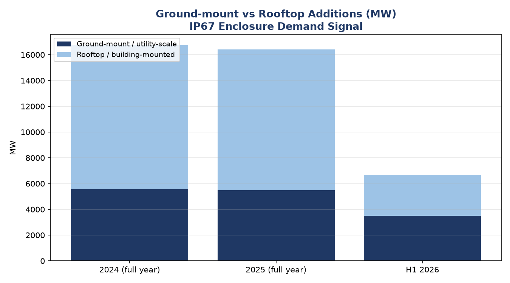

# Germany Solar Market Dashboard

Market intelligence analysis of Germany's solar PV market — built to guide export sales
strategy for **IP67-rated solar enclosures**, and as a portfolio project applying data
analysis to a real business decision.

**Two deliverables from one dataset:**
- `analysis.ipynb` / `analysis.py` — Python/pandas analysis + charts (this repo)
- An Excel/Power BI dashboard version for non-technical stakeholders (available on request)

## Project goal

After meeting European solar buyers at **Intersolar Munich 2026**, I wanted to answer three
questions with data instead of guesswork:

1. Is the German solar market actually growing fast enough to justify prioritizing it?
2. **Which German states** should get the first follow-up calls?
3. Which installation type — **rooftop or ground-mount/utility-scale** — drives the most
   demand for heavy-duty outdoor IP67 enclosures (our product)?

## Key findings

- Germany's installed solar capacity reached **117 GW at end-2025**, growing to **~125 GW by
  mid-2026** — up roughly 50% since end-2023.
- Annual additions (**16.4 GW in 2025**) are running *below* the **~22 GW/year** pace Germany
  needs to hit its 215 GW-by-2030 target — a supply gap that creates urgency for buyers to
  lock in reliable suppliers now.
- **Bavaria, Baden-Württemberg, and North Rhine-Westphalia** together account for **~52%** of
  all state-attributed 2025 additions — the clear priority states for outreach.
- The **ground-mount / utility-scale segment — the segment needing the most heavy-duty IP67
  enclosures — grew from ~33% of new capacity (2024-2025) to over 50% in H1 2026**, a strong
  signal to prioritize utility-scale EPCs and solar-park developers.

## Dashboard preview



See `charts/` for all four charts (cumulative capacity trend, annual additions vs. 2030
target pace, top states by 2025 addition, and this segment split), or open `analysis.ipynb`
to see them alongside the code that generated them.

## Data sources

All figures are sourced from official/primary sources wherever available; secondary and
estimated figures are explicitly flagged in `data/national_annual.csv`
(`data_confidence` column).

| Source | What it provided |
|---|---|
| [Bundesnetzagentur — Growth in renewable energy 2025](https://www.bundesnetzagentur.de/SharedDocs/Pressemitteilungen/EN/2026/20260108_EEG.html) | 2025 national addition (16.4 GW), cumulative capacity (117 GW), Bavaria state-level lead |
| [Bundesnetzagentur — Growth in renewable energy 2024](https://www.bundesnetzagentur.de/SharedDocs/Pressemitteilungen/EN/2025/20250108_EE.html) | 2024 comparison figures |
| [Fraunhofer ISE — German Public Electricity Generation 2025](https://www.ise.fraunhofer.de/en/press-media/press-releases/2026/german-public-electricity-generation-in-2025-wind-and-solar-power-take-the-lead.html) | Generation stats, 2025 addition cross-check |
| [PV Tech — Germany solar PV generation H1 2026](https://www.pv-tech.org/) | Mid-2026 cumulative capacity, H1 2026 ground-mount/rooftop split |
| [ZFK — Solar-Photovoltaik-Ausbau 2025 nach Bundesländern](https://www.zfk.de/energie/strom/solar-photovoltaik-ausbau-2025-bundeslaender-bayern-bremen-hamburg-nrw) | State-level 2025 rankings, ground-mount vs rooftop by state |
| [Solar Cluster Baden-Württemberg](https://solarcluster-bw.de/de/news/news-einzelansicht/solarausbau-in-baden-wuerttemberg-rekord-nur-knapp-verfehlt) | Baden-Württemberg 2025 addition detail |
| [Clean Energy Wire — Solar power in Germany](https://www.cleanenergywire.org/factsheets/solar-power-germany-output-business-perspectives) | Historical context (2015-2017 trough) |

**Note on data confidence:** 2023-2026 figures are directly sourced from Bundesnetzagentur /
Fraunhofer ISE releases. 2015-2022 annual additions are reconstructed from public industry
commentary (no single official annual table was available for that range) and are flagged as
approximate. A full 16-state breakdown and an exact year-by-year ground-mount/rooftop split
were not available in a single published source, so the state and segment tables use the
best available reconciliation — see the `note` / confidence columns in each CSV for details.

## How to reproduce

```bash
git clone <this-repo>
cd germany-solar-market-dashboard
pip install -r requirements.txt
python3 analysis.py          # regenerates charts/*.png and prints key findings
```

Or just open `analysis.ipynb` — all outputs (charts + findings) are already saved in the
notebook, so it renders directly on GitHub without needing to run anything.

## Repo structure

```
germany-solar-market-dashboard/
├── README.md
├── requirements.txt
├── analysis.py           # script version — run to regenerate charts
├── analysis.ipynb         # notebook version — charts pre-rendered, viewable on GitHub
├── data/
│   ├── national_annual.csv
│   ├── state_data_2025.csv
│   └── segment_data.csv
└── charts/
    ├── 01_cumulative_capacity.png
    ├── 02_annual_additions.png
    ├── 03_top_states_2025.png
    └── 04_segment_split.png
```

## Tools used
Python, pandas, matplotlib. (Companion version built in Excel/Power BI for non-technical
stakeholders — KPI cards, pivot-style tables, and the same four charts, with live formulas.)

---
*Compiled 26 Jul 2026. This is a self-directed market-analysis project connecting data
analysis skills to a real export-sales decision.*
